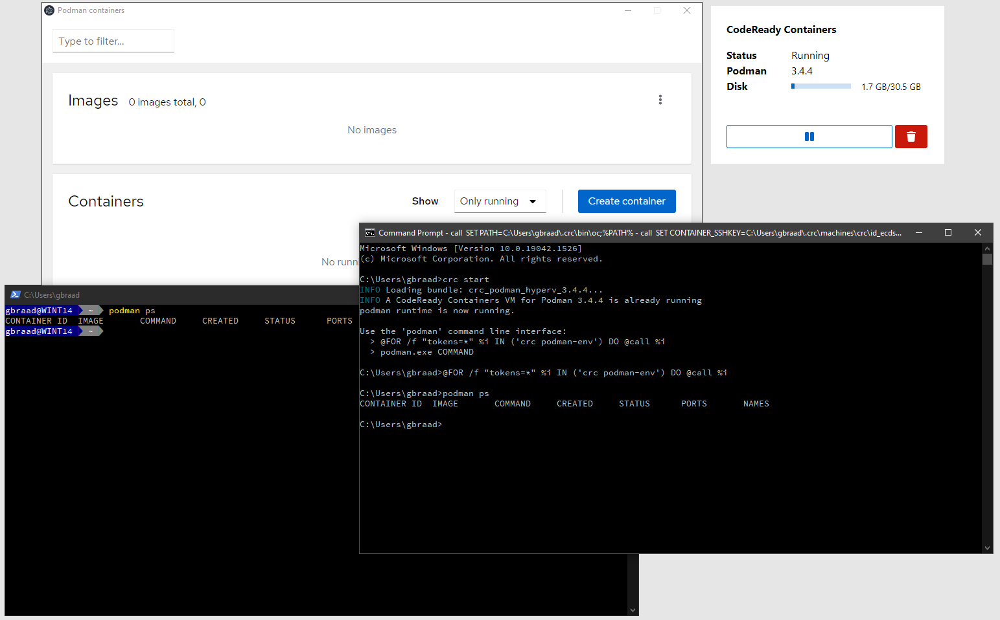

Electron app for CodeReady Containers
=====================================




[](https://circleci.com/gh/code-ready/tray-electron/tree/master)

# Release

```
$ npm install
$ npm release
```

You also need to add `crc` binary to the app. 

For macOS, please also run:
```
$ cp <path to crc release binary> release/tray-electron-darwin-x64/tray-electron.app/Contents/Resources/app/
```